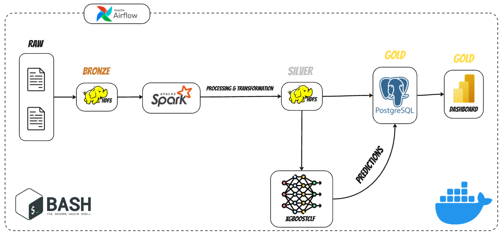
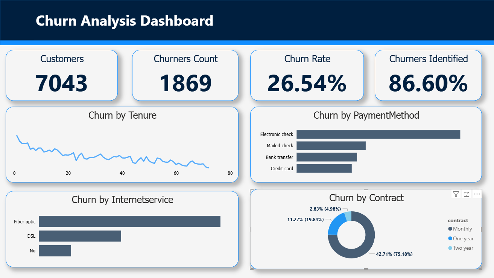

# 📞 Telecom Customer Churn Prediction Pipeline

End-to-end data engineering and machine learning pipeline to predict telecom customer churn using Apache Spark, HDFS, Airflow, PostgreSQL, and XGBoost.

## 🚀 Project Overview

The goal of this project is to build a production-ready churn prediction pipeline that processes telecom customer data, trains a churn classification model, and visualizes insights in a dashboard
to identify what causes customers to churn. It demonstrates capabilities in data engineering and machine learning

---

## 🧱 Architecture

This project is built using a **modular architecture** based on the Medallion Data Lake design:

- **Bronze Layer**: Raw CSV ingested to HDFS
- **Silver Layer**: Cleaned and preprocessed data (nulls handled, types fixed)
- **Gold Layer**: Predictions + enriched data written to PostgreSQL for dashboard consumption

All stages are orchestrated using Apache Airflow and run inside Docker containers.


*Figure 1: High-level overview of the Churn Analysis Data Pipeline Architecture.*

---

## 🛠️ Tech Stack

| Layer             | Tools Used                                                |
|------------------|------------------------------------------------------------|
| Ingestion        | Apache Airflow, HDFS (Namenode, Datanode)                  |
| Processing       | Apache Spark                                               |
| Modeling         | XGBoost, SMOTE (imbalanced-learn), scikit-learn            |
| Storage          | PostgreSQL                                                 |
| Dashboard        | Power BI                                                   |
| Orchestration    | Apache Airflow                                             |
| Environment      | Docker Compose                                             |

---

## 🧹 Data Pipeline

1. **Ingestion (Bronze Layer)**:
   - Data ingested from a Telco CSV file into HDFS.

2. **Cleansing (Silver Layer)**:
   - Missing `TotalCharges` values handled.
   - Customer IDs and other string columns cleaned.
   - Target column `Churn` encoded to 1/0.
   - Stored as Parquet in HDFS.

3. **Modeling**:
   - Only 80% of the cleaned data used for training.
   - Used **SMOTE** to handle class imbalance.
   - Trained with **XGBoost** classifier.
   - Optimal threshold tuned to **0.4**.
   - Achieved:
     - **Recall**: 87%
     - **Accuracy**: 75%
   - Predictions joined with original records and saved in PostgreSQL (Gold Layer).

4. **Visualization**:
   - Power BI dashboard built to display:
     - Churn rate
     - Churn breakdown by gender, contract type, payment method, etc.
     - Model prediction performance (recall, confusion matrix)
     - High-risk customer segments

---

## 📊 Key Business Insight

- Early identification of potential churners enables proactive retention strategies.
- Catching the Services that causes the high probability for churn (eg. Internet Service, Contaract Type)
- Dashboards allow filtering churn trends by customer attributes to identify high-risk profiles.
- Predictive model performs well on recall, helping capture most actual churners.


*Figure 2: Gold PowerBI Dashboard Connected to PostgreSQL.*

---

## 📁 Project Structure

```bash
├── dags/                     # Airflow DAGs
│   ├── Churn_Analysis_Pipeline.py
├── spark/           # Spark transformation and model scripts
├── data/
├── jars/                    # Jars used for PostgreSQL
├── notebooks/               # EDA and model experimentation
├── docker-compose.yml       # Containerized environment
├── Dockerfile               # Customized Spark Bitnami Image
└── README.md
